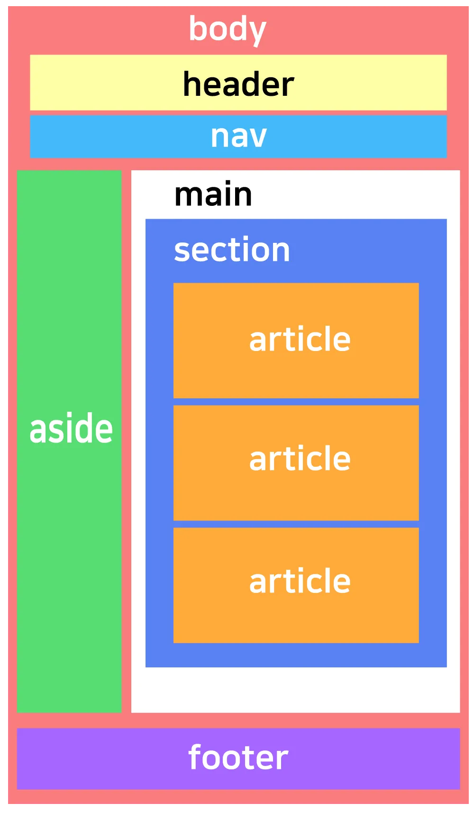

# CSS(Cascading Style Sheet) 
- 중첩될 수 있는, 디자인 속성이 겹칠 수 있음을 의미

## 단축킨

- `Ctrl + Shift+ I` : 개발자 도구(F12)
- `Ctrl + Shift + C` : element 잡기

## CSS 우선 순위

- 식별자에 따라서 (id, class)  : 넓은 것(general)과 좁은 것(detail)인 있다면 좁은 것(detail)이 우선

### 식별자

- id:  unique
- class: group
- tag: general

### 순서

1. 인라인 스타일 <style =””>
2. id 선택자
3. 클래스, 속성, 가상 클래스 선택자
4. 요소(태그) 선택자(div, p) 
태그(요소) 선택자 (`div`, `p`, `h1` 등)
5. 전체 선택자 *
6. 중요도 !important

### TIP

- float : word 로 이해하기
- lorem 로렘 입숨 : 텍스트 생성기

### div 태그 vs 시맨틱 태그

- 시맨틱 태그 : 기능상 영향을 미치지 않지만 의미를 가지고 있는 것

`section`, `header`, `article`, `aside`, `footer`, `form`, `main`, `nav`

잘 적용된 웹사이트로 한번 보기 : https://developer.mozilla.org/ko/



## div 와 span

div : 블럭요소 (전체 잡아줌)

span : 인라인 요소 (닫는 태그 없는거)

`<div>`와 `<span>`은 HTML에서 가장 기본적인 컨테이너 요소이지만, 각각의 역할과 용도가 다릅니다.

| 속성 | `<div>` | `<span>` |
| --- | --- | --- |
| **구분** | 블록 레벨 요소 | 인라인 요소 |
| **기본 성질** | 한 줄을 차지하며 새로운 줄에서 시작됨 | 현재 줄에서 이어서 표시됨 |
| **주요 용도** | 섹션이나 그룹을 만들 때 사용 | 텍스트나 요소의 일부를 스타일링할 때 사용 |
| **사용 예시** | 레이아웃을 구성하는 컨테이너 역할 | 텍스트나 특정 부분에 스타일을 적용할 때 |

### 사용 예시

### 1. `<div>` 사용 예시 (블록 레벨 요소)

```html
<div style="background-color: lightgray; padding: 10px;">
    <h2>제목</h2>
    <p>이것은 div 내부의 문장입니다.</p>
</div>

```

- `<div>`는 블록 요소라서 내부에 여러 요소를 포함할 수 있으며, 레이아웃을 구성할 때 주로 사용됩니다.

### 2. `<span>` 사용 예시 (인라인 요소)

```html
<p>이 문장에서 <span style="color: red;">이 부분만</span> 강조됩니다.</p>

```

- `<span>`은 특정 단어만 스타일을 변경하는 등 텍스트 일부를 조작하는 데 유용합니다.

### 결론

- `<div>`는 **레이아웃을 구성하는 블록 컨테이너**로 사용됩니다.
- `<span>`은 **텍스트 일부를 스타일링하거나 특정 부분을 조작하는 인라인 컨테이너**입니다.

따라서 **전체적인 구조를 나누고 배치할 때는 `<div>`**, **텍스트나 특정 요소에만 스타일을 적용할 때**는 `<span>`을 사용하면 됩니다.

### div default : container 라고 함

### inline-block : inline 요소를 block 으로 바꿔주는 것

## 실무

실제로는 position : relative (absolute 대신) 또는 %로 많이 쓴다.

## Basic

- HTML, CSS, JS 는 스크립트 언어(순차적으로 위에서 아래로 읽으면서 처리)
- 같은게 있다면 나중에 있는걸 먼저 있는게 오버라이딩한다. 마지막꺼가 실행(스크립트라서)

## menu1.html

.container .item : 컨테이너 바로 아래 있는 (모든 depth)의 아이템

```html
<html>
    <style>
         .container .last {
            float: right;
        }
        .container .item {
            float: left;
            width: 100px;
        }
       
    </style>
    </head>
<body>
    <div class="container">
        <div class="item">menu1</div>
        <div class="item">menu2</div>
        <div class="item">menu3</div>
        <div class="item last">login</div>
    </div>    
</body>
</html>
```

.container > .item : 컨테이너 바로 아래 있는 아이템(바로 밑에 직계 1st-depth만)

css Zen Garden 사이트 검색 :html파일 긁어오기

### 이모지

- font awesome
- css icons
- bootstrap icon

### CDN : Contents Delivery Network

serif(꼬리 있음) vs sans-serif(꼬리 없음)

times new roman : 대표적인 serif font 

## 단위

- px (절대적)
- em (배수)
- rem (root em)

### 📏 `px`, `em`, `rem` 차이 비교

| 단위 | 기준 | 특징 |
| --- | --- | --- |
| `px` | **고정 크기** | 절대적인 크기로, 화면 크기에 따라 변하지 않음 |
| `em` | **부모 요소의 `font-size`** | 부모 크기에 따라 상대적으로 변함 |
| `rem` | **루트 요소(`<html>`)의 `font-size`** | 전체 문서에서 일관된 크기 조정 가능 |

---

## 1. **px (픽셀)**

✅ **고정 크기**이므로 화면 크기나 부모 요소와 관계없이 동일한 크기로 표시됨.

```css
.box {
  width: 100px;
  font-size: 16px;
}

```

📌 **장점**

- 정확한 크기를 지정할 수 있음.
- 레이아웃이 변하지 않음.

📌 **단점**

- 반응형 디자인에 유연하지 않음.
- 사용자가 브라우저에서 글자 크기를 조정해도 적용되지 않을 수 있음.

---

## 2. **em (부모 요소 기준)**

✅ **부모 요소의 `font-size`**를 기준으로 크기가 결정됨.

```css
.parent {
  font-size: 20px;
}

.child {
  font-size: 1.5em;  /* 1.5 × 20px = 30px */
}

```

📌 **장점**

- 부모 요소에 따라 크기가 조절됨 → 유연한 디자인 가능.
- 가변적인 크기로 반응형 웹에서 유용.

📌 **단점**

- 부모 요소가 중첩될 경우 크기 계산이 복잡해질 수 있음.

```css
.parent {
  font-size: 20px;
}

.child {
  font-size: 1.5em;  /* 30px */
}

.grandchild {
  font-size: 1.5em;  /* 1.5 × 30px = 45px */
}

```

🛑 **계산이 꼬일 수 있음!**

---

## 3. **rem (루트 요소 기준)**

✅ **최상위 `<html>`의 `font-size`**를 기준으로 크기가 결정됨.

```css
html {
  font-size: 16px;
}

.box {
  font-size: 2rem;  /* 2 × 16px = 32px */
}

```

📌 **장점**

- 부모 요소와 무관하게 **일관된 크기** 적용 가능.
- 브라우저 기본 글꼴 크기 조정에 따라 유동적으로 변화.
- 계산이 간단함 (`1rem = html의 font-size`).

📌 **단점**

- `html`의 `font-size`를 변경하면 전체 스타일이 바뀔 수 있음.

---

## 4. **px, em, rem 차이 예제**

```css
html {
  font-size: 16px;
}

.container {
  font-size: 20px;
}

.px-example {
  font-size: 20px; /* 고정 크기 */
}

.em-example {
  font-size: 1.5em; /* 부모(20px)의 1.5배 → 30px */
}

.rem-example {
  font-size: 1.5rem; /* 루트(html 16px)의 1.5배 → 24px */
}

```

---

## 5. **어떤 걸 써야 할까?**

✅ **고정 크기가 필요할 때** → `px`

✅ **부모 요소에 따라 크기를 조절할 때** → `em`

✅ **전체적으로 일관된 크기를 유지할 때** → `rem` (가장 추천🔥)

보통 **`px`보다 `rem`을 선호**하는 추세야!

특히 반응형 웹 디자인에서는 `rem`을 사용하면 유지보수가 훨씬 편해져. 🚀

## Transition

CSS 트랜지션(transition)은 요소의 상태 변화(색상, 크기, 위치 등)를 부드럽게 애니메이션 효과로 만드는 데 사용돼.

### 1. **기본 트랜지션**

```css
.box {
  width: 100px;
  height: 100px;
  background: blue;
  transition: all 0.5s ease;
}

.box:hover {
  width: 150px;
  height: 150px;
  background: red;
}

```

📌 `transition: all 0.5s ease;` → 요소의 모든 속성이 0.5초 동안 부드럽게 변함.

---

### 2. **색상 변화**

```css
.button {
  background-color: blue;
  color: white;
  padding: 10px 20px;
  transition: background-color 0.3s ease-in-out;
}

.button:hover {
  background-color: red;
}

```

📌 `background-color` 속성이 0.3초 동안 변화.

---

### 3. **크기 변화**

```css
.scale-box {
  width: 100px;
  height: 100px;
  background: green;
  transition: transform 0.4s ease-out;
}

.scale-box:hover {
  transform: scale(1.2);
}

```

📌 `transform: scale(1.2);` → 요소가 1.2배 확대됨.

---

### 4. **회전 효과**

```css
.rotate-box {
  width: 100px;
  height: 100px;
  background: orange;
  transition: transform 0.5s linear;
}

.rotate-box:hover {
  transform: rotate(180deg);
}

```

📌 `rotate(180deg);` → 요소가 180도 회전.

---

### 5. **투명도 변화**

```css
.fade-box {
  width: 100px;
  height: 100px;
  background: purple;
  opacity: 1;
  transition: opacity 0.5s ease-in;
}

.fade-box:hover {
  opacity: 0.3;
}

```

📌 `opacity: 0.3;` → 마우스를 올리면 투명도가 30%로 감소.

---

### 6. **이동 효과**

```css
.move-box {
  width: 100px;
  height: 100px;
  background: teal;
  transition: transform 0.6s ease-in-out;
}

.move-box:hover {
  transform: translateX(100px);
}

```

📌 `translateX(100px);` → 요소가 오른쪽으로 100px 이동.

---

### 7. **다단계 트랜지션**

```css
.multi-box {
  width: 100px;
  height: 100px;
  background: pink;
  transition: width 0.3s ease, background 0.5s linear;
}

.multi-box:hover {
  width: 150px;
  background: black;
}

```

📌 `width`는 0.3초 동안 변화, `background`는 0.5초 동안 변화.

---

### 8. **텍스트 색상과 그림자 변화**

```css
.text-effect {
  font-size: 24px;
  color: black;
  transition: color 0.3s ease-in-out, text-shadow 0.5s ease-in;
}

.text-effect:hover {
  color: red;
  text-shadow: 3px 3px 5px rgba(0, 0, 0, 0.5);
}

```

📌 `text-shadow`가 추가되면서 색상이 변하면서 그림자가 생김.

---

### 9. **입체감 효과 (box-shadow)**

```css
.shadow-box {
  width: 100px;
  height: 100px;
  background: lightblue;
  transition: box-shadow 0.4s ease-in-out;
}

.shadow-box:hover {
  box-shadow: 5px 5px 15px rgba(0, 0, 0, 0.5);
}

```

📌 `box-shadow`를 추가하여 입체감 효과.

---

### 10. **여러 개의 효과 조합**

```css
.combo-box {
  width: 100px;
  height: 100px;
  background: yellow;
  transition: transform 0.5s ease, background 0.3s linear;
}

.combo-box:hover {
  transform: rotate(45deg) scale(1.2);
  background: red;
}

```

📌 `rotate(45deg)` + `scale(1.2)` + `background 변경` 효과가 동시에 적용됨.

---

이런 다양한 트랜지션 효과들을 조합해서 멋진 UI를 만들 수 있어! 😃🚀

## Animation - Keyframes

CSS에서 애니메이션을 정의하는 규칙

## 🎬 `@keyframes`를 사용한 CSS 애니메이션

`@keyframes`는 **CSS에서 애니메이션을 정의하는 규칙**이야.

어떤 속성이 시간에 따라 어떻게 변할지를 지정할 수 있어.

---

### 1️⃣ 기본 문법

```css
@keyframes animation-name {
  0% {
    /* 시작 상태 */
  }
  100% {
    /* 끝나는 상태 */
  }
}

```

**🚀 예제: 색상 변화 애니메이션**

```css
@keyframes changeColor {
  0% {
    background-color: red;
  }
  100% {
    background-color: blue;
  }
}

.box {
  width: 100px;
  height: 100px;
  animation: changeColor 2s linear infinite;
}

```

**📌 설명**

- `animation-name: changeColor;` → `@keyframes changeColor` 애니메이션을 적용.
- `animation-duration: 2s;` → 2초 동안 애니메이션 실행.
- `animation-timing-function: linear;` → 일정한 속도로 변화.
- `animation-iteration-count: infinite;` → 무한 반복.

---

## 2️⃣ 여러 단계 애니메이션 (0% ~ 100%)

```css
@keyframes multiStep {
  0% {
    background-color: red;
    transform: translateX(0);
  }
  50% {
    background-color: yellow;
    transform: translateX(100px);
  }
  100% {
    background-color: blue;
    transform: translateX(0);
  }
}

.box {
  width: 100px;
  height: 100px;
  animation: multiStep 3s ease-in-out infinite;
}

```

📌 **0% → 50% → 100%로 변화하면서 색상과 위치 변경!**

---

## 3️⃣ 애니메이션 속성 (animation 단축 속성)

```css
animation: name duration timing-function delay iteration-count direction fill-mode;

```

| 속성 | 설명 | 예제 |
| --- | --- | --- |
| `animation-name` | 사용할 애니메이션 이름 | `animation: move;` |
| `animation-duration` | 애니메이션 지속 시간 | `animation: move 2s;` |
| `animation-timing-function` | 속도 조절 | `ease, ease-in, ease-out, linear` |
| `animation-delay` | 시작 전 대기 시간 | `animation: move 2s 1s;` (1초 후 시작) |
| `animation-iteration-count` | 반복 횟수 | `infinite, 1, 2, 3...` |
| `animation-direction` | 방향 지정 | `normal, reverse, alternate` |
| `animation-fill-mode` | 애니메이션 끝난 후 상태 | `forwards, backwards, both` |

---

## 4️⃣ `animation-direction` (방향 설정)

```css
@keyframes bounce {
  0% {
    transform: translateY(0);
  }
  50% {
    transform: translateY(-50px);
  }
  100% {
    transform: translateY(0);
  }
}

.bounce {
  width: 100px;
  height: 100px;
  background: green;
  animation: bounce 1s infinite alternate;
}

```

📌 `animation-direction: alternate;` → **처음엔 정방향, 다음엔 역방향** 실행! 🚀

---

## 5️⃣ `animation-fill-mode` (애니메이션이 끝난 후 상태)

```css
@keyframes fadeIn {
  0% {
    opacity: 0;
  }
  100% {
    opacity: 1;
  }
}

.fade-box {
  animation: fadeIn 2s forwards;
}

```

📌 `forwards;` → 애니메이션이 끝난 후 마지막 상태(`opacity: 1;`) 유지!

---

## 6️⃣ `animation-delay` (지연 효과)

```css
@keyframes scaleUp {
  0% {
    transform: scale(1);
  }
  100% {
    transform: scale(1.5);
  }
}

.delay-box {
  animation: scaleUp 2s ease-in-out 1s infinite;
}

```

📌 `1s` 후에 애니메이션이 시작됨! ⏳

---

### ✅ **실전 예제: 박스 움직이기**

```css
@keyframes moveBox {
  0% {
    left: 0;
  }
  50% {
    left: 50%;
  }
  100% {
    left: 100%;
  }
}

.moving-box {
  position: absolute;
  width: 100px;
  height: 100px;
  background: orange;
  animation: moveBox 3s ease-in-out infinite alternate;
}

```

📌 `position: absolute;`를 사용해서 박스를 **좌우로 움직이게** 만들 수 있음! 🏃💨

---

### 💡 **정리**

✔ `@keyframes`를 사용하면 다양한 애니메이션을 만들 수 있음.

✔ `animation` 속성을 조합해서 `duration`, `delay`, `iteration`, `direction` 등을 조절 가능.

✔ `animation-fill-mode: forwards;` → 애니메이션 끝난 후 최종 상태 유지.

✔ `animation-direction: alternate;` → 정방향 & 역방향 반복.

---

🔥 **이제 멋진 애니메이션을 만들어보자!** 🚀

## 시맨틱 요소

- SEO 검색 엔진 유리하다(SEO 최적화 기법: h1이 하나만 있어야 한다 heading) :SEO 전문 교육 기관 가면 됨
- a태그 참조링크  ,상호참조하는게 좋다. ex) nav바

```html
<header>

</header>
<main>
    <nav>

    </nav>
    <article>

    </article>
</main>
<footer>
    
</footer>
```

## CDN - integrity

link herf에서 integrity : 무결성 검증을 안하려면 **integrity** 없애기

체크섬: 무결성 검증

integrity

나의 파일에 hash를 계산해서 적어둔것

내 5.3.3을 내 원본 출처가 아닌 다른곳에서 가져왔다면 비교해서 같은지 보시오…

icon

https://fonts.google.com/icons

https://m2.material.io/

- docx : 워드문서의 xml 포맷
- xlsx : 엑셀문서의 xml 포맷
- webp : 웹용 이미지