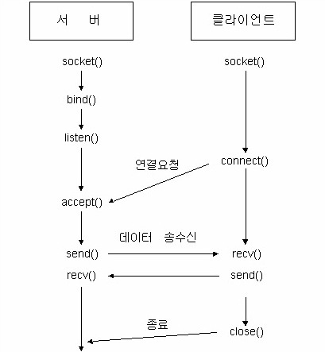

# HTTP와 SSE(Server-Sent Events) 통신 방식, Web Socket 이해하기

- 신호를 주고받는 방식: 유선 통신, 무선 통신
- 무선통신에는 단방향통신, 양방향 통신(송수신기)
- 양방향 통신에는 아날로그 방식, 디지털 방식



## HTTP 통신의 특성

- Request Response 구조의 단방향 통신
- 비연결성(요청-응답 후 연결이 즉시 종료된다)
- 무상태성(Stateless, 서버는 이전 요청 정보를 기억하지 않는다)
- 실시간 통신에는 적합하지 않다.

## 지속적인 연결이 필요한 시나리오

### pooling vs long pooling

### pooling

- 클라이언트가 주기적으로 서버에 요청한다.
- 구현은 간단, 불필요한 요청이 많고 서버 부하가 증가한다.

### long pooling


- 클라이언트 요청 후 서버는 이벤트 발생까지 대기한다.
- 이벤트 발생시 응답하고 클라이언트는 즉시 새 요청을 보낸다.
- 연결을 반복해야 한다.

## Pooling vs Long Pooling

클라이언트가 서버의 상태나 데이터를 주기적으로 확인하는 두 가지 방식인 **Polling**과 **Long Polling**의 차이점

### 1. 기본 개념

| 항목      | Polling                                                  | Long Polling                                                           |
| --------- | -------------------------------------------------------- | ---------------------------------------------------------------------- |
| 정의      | 클라이언트가 정기적으로 서버에 요청하여 새 데이터를 확인 | 클라이언트가 요청을 보내고, 새 데이터가 있을 때까지 서버가 응답을 지연 |
| 연결 방식 | 짧은 요청-응답 주기                                      | 요청 시 긴 대기 후 응답, 응답 후 재요청                                |
| 목적      | 단순 주기적 확인                                         | 거의 실시간에 가까운 데이터 갱신                                       |

### 2. 동작 방식

| 항목           | Polling                            | Long Polling                          |
| -------------- | ---------------------------------- | ------------------------------------- |
| 요청 주기      | 고정 시간 간격 (예: 5초마다)       | 서버에서 새 데이터가 생길 때까지 대기 |
| 서버 부하      | 요청이 많아 서버에 부하 발생 가능  | 요청 수는 적지만 대기 연결 처리 필요  |
| 지연 시간      | 요청 간 간격에 따라 지연 발생 가능 | 데이터가 생기면 즉시 응답, 낮은 지연  |
| 연결 유지 시간 | 매우 짧음 (즉시 응답)              | 응답 전까지 연결 유지                 |

### 3. 효율성과 사용성

| 항목            | Polling                              | Long Polling                         |
| --------------- | ------------------------------------ | ------------------------------------ |
| 네트워크 사용량 | 많음 (불필요한 요청 포함)            | 적음 (실제 데이터 발생 시에만 응답)  |
| 구현 난이도     | 낮음                                 | 중간 (타임아웃, 재연결 등 처리 필요) |
| 실시간성        | 낮음                                 | 비교적 높음                          |
| 브라우저 호환성 | 전통적인 방식으로 모든 환경에서 가능 | 모든 환경에서 가능                   |

### 4. 요약

| 항목        | Polling                                   | Long Polling                         |
| ----------- | ----------------------------------------- | ------------------------------------ |
| 장점        | 구현이 쉽고 보편적                        | 지연이 적고 실시간에 가까움          |
| 단점        | 서버 부하, 불필요한 요청                  | 구현 복잡도, 서버 리소스 점유        |
| 적합한 상황 | 상태 확인 빈도가 낮은 간단한 애플리케이션 | 실시간이 중요한 채팅, 알림 시스템 등 |

## SSE(Sever-Sent Events)의 특성

- HTTP 기반 단방향 통신 채널(서버 > 클라이언트 방향으로 데이터 전송)
- 지속적인 데이트 스트림 : 한번 연결 후 여러 이벤트를 지속적으로 전송
- 자동 재연결 기능
- text/event-stream 방식

### Client 측 SSE 구현방식

1. EventSource API 사용(표준)
   - 브라우저 내장 API 로 구현
   - 이벤트 리스너를 통해 서버 메세지 수신

```Js
    //연결설정
    const eventSource = new EventSource('/events');
    //메세지 처리
    eventSource.onmessage = (e) => {
    };
    //에러처리
    eventSource.onerror = (err) => {
    };
    //연결종료
    eventSource.close();

```

### Server 측 SSE 구현방식

**1. EventSource API 사용(표준)**

```Js
    //content-type 의 형식이 text/event-stream으로 정해져있다.
    "Content-Type": "text/event-stream";

    //connecrion header 설정
    'Cache-Control', 'no-cache';
     //데이터 전송
    data: {...}

    //연결 정리
    close();

```

**2. Fetch API + ReadableStream 활용**

- 더 많은 제어가 필요한 경우 사용
- 스트림 처리를 수동을 관리

**3. RxJS 라이브러리 활용**

- 반응형 프로그래밍 방식으로 이벤트 처리
- 복잡한 스트림 처리와 변환이 가능하다.

### 실제 구현시 고려사항

- 연결 타임아웃 처리

  - 클라이언트와 서버 간 연결이 비정상적으로 끊긴 경우를 감지해야 한다. 그렇지 않으면 "죽은 연결(dead connection)"이 계속 유지되어 리소스 낭비가 발생할 수 있다.
  - **WebSocket**의 경우, **Ping/Pong 하트비트 메시지**를 정기적으로 주고받아 연결 상태를 확인한다.
  - **SSE**는 서버가 일정 시간마다 빈 이벤트를 보내는 방식으로 연결 유지 상태를 확인한다.
  - ex: WebSocket, Node.js
    ```JS
        setInterval(() => {
            if (socket.readyState === WebSocket.OPEN) {
            socket.send(JSON.stringify({ type: 'ping' }));
            }
        }, 30000); // 30초마다 ping
    ```

- 연결 수 제한 관리 : 대부분의 브라우저는 **동일 오리진(origin)**에 대해 동시 연결할 수 있는 **최대 수(약 6개)**가 제한되어 있다.

  - 하나의 페이지에서 여러 개의 EventSource 또는 WebSocket을 열면 제한을 초과할 수 있다.
  - 다른 리소스 요청(CSS, 이미지 등)에 영향을 줄 수 있다.
  - 해결 방법: 하나의 WebSocket 또는 SSE 연결을 공유하고, 그 위에 멀티플렉싱(Multiplexing) 구현
    - ex: 채팅, 알림 등 여러 기능을 하나의 커넥션으로 처리
  - ex: WebSocket Multiplex
    ```js
    socket.send(
      JSON.stringify({
        channel: "chat",
        data: "안녕하세요",
      })
    );
    ```

- 확장성 설계 (메시지 브로커 활용): 서버가 여러 인스턴스로 수평 확장되면, 각 인스턴스가 실시간 메시지를 공유할 방법이 필요하므로 Redis/Kafka 같은 메세징 시스템을 활용한다.

  - 해결 방법: Redis Pub/Sub, Kafka, RabbitMQ 등의 메시징 시스템을 통해 각 서버 간 메시지를 브로드캐스트
  - 아키텍처 예시 : Client → WebSocket 서버 → Redis Pub/Sub → 다른 WebSocket 서버들
  - ex: Node.js + Redis

    ```JS
        const redis = require('redis');
        const subscriber = redis.createClient();

        subscriber.subscribe('chat');
        subscriber.on('message', (channel, message) => {
        // 모든 연결된 사용자에게 메시지 전송
        wss.clients.forEach(client => client.send(message));
        });

    ```

- 브라우저 호환성 : IE 지원을 위한 폴리필 사용을 고려한다.

  - SSE는 Internet Explorer에서 기본적으로 지원되지 않는다.
  - 해결 방법: EventSource polyfill 또는 fallback 방식(XHR long polling 등) 사용, 사용자 브라우저를 감지하여 조건부 로딩 적용
  - ex: 폴리필 사용

  ```html
  <!-- polyfill -->
  <script src="https://unpkg.com/event-source-polyfill/eventsource.min.js"></script>
  <script>
    const es = new EventSource("/events");
    es.onmessage = function (e) {
      console.log("Event:", e.data);
    };
  </script>
  ```

## Web Socket 과 SSE 비교

- 실시간 통신을 구현할 때 사용하는 두 가지 주요 기술인 **WebSocket**과 **SSE(Server-Sent Events)** 의 차이점을 정리한 표

### 1. 기본 개요

| 항목          | WebSocket              | SSE (Server-Sent Events)              |
| ------------- | ---------------------- | ------------------------------------- |
| 전송 방향     | 양방향 (Full-duplex)   | 단방향 (서버 → 클라이언트)            |
| 프로토콜      | `ws://` 또는 `wss://`  | `http://` 또는 `https://` (HTTP 기반) |
| 표준화        | RFC 6455               | HTML5 표준                            |
| 브라우저 지원 | 대부분의 최신 브라우저 | 대부분의 최신 브라우저 (IE 제외)      |

** WSS(WebSocket Secure)는 WebSocket 프로토콜의 보안버전<br>
** `ws://`는 보안이 적용되지 않은 일반 WebSocket 연결을 의미하며, `wss://`는 TLS(Transport Layer Security) 암호화를 사용하는 보안 WebSocket 연결을 의미한다<br>
** Socket.io는 WS를 기반으로 만들어진 실시간 소통 라이브러리<br>
** WSS:

1. TLS(Transport Layer Security) 암호화 지원.

   - WSS(WebSocket Secure)는 HTTPS(Hypertext Transfer Protocol Secure)과 유사하게 TLS/SSL 인증서를 사용하여 데이터를 암호화한다.
   - 이를 통해 클라이언트와 서버 간의 통신을 보호하고, 데이터가 도청, 변조되지 않도록 한다.

2. 보안 강화.

   - WSS는 일반 WebSocket(ws://)보다 보안 수준이 높으며, 네트워크 트래픽을 감시하거나 공격자가 데이터를 가로채는 것을 방지.

3. HTTPS 환경과 함께 사용.

- WSS는 HTTPS 환경에서 사용되며, HTTPS를 사용하는 웹사이트에서 반드시 WSS를 사용해야 한다.
- 브라우저는 HTTPS 사이트에서 ws:// 연결을 허용하지 않는다.
  | **특징** | **HTTPS** | **WSS** |
  | ----------- | ------------------------ | ---------------------------- |
  | **사용 프로토콜** | HTTP over TLS | WebSocket over TLS |
  | **포트 번호** | 443 | 443 (대부분의 경우) |
  | **통신 방식** | 요청-응답 (Request-Response) | 양방향 (Full-Duplex, Real-Time) |
  | **사용 목적** | 일반 웹 브라우징 및 API 통신 | 실시간 데이터 교환 |

4. WSS를 설정하려면?

- 서버에서 SSL/TLS 인증서 설치.
  - 인증서는 Let’s Encrypt, DigiCert 등에서 발급받아야 한다.
  - 예: Nginx나 Apache에 TLS를 설정.
- WebSocket 서버 구현.
  - Node.js, Java, Python 등에서 WebSocket 서버를 구현하고, TLS 인증서를 적용한다.
- 클라이언트에서 WSS 연결 사용.
  - 클라이언트 코드는 wss://를 사용하여 WebSocket 서버와 연결해야한다.

```JS
  const socket = new WebSocket('wss://example.com/socket');
  socket.onopen = () => console.log('Connected');
  socket.onmessage = (event) => console.log(event.data);
```

5. 요약.

- WSS는 WebSocket의 보안 버전으로, 클라이언트와 서버 간 데이터를 암호화하여 안전하게 전달한다.
- ws://는 HTTP와 같이 보안이 없는 환경에서 사용되고, wss://는 HTTPS처럼 TLS를 적용한 환경에서 사용된다.
- HTTPS 웹사이트는 반드시 wss://를 사용해야 한다.

### 2. 사용 목적

| 항목                     | WebSocket                       | SSE                                      |
| ------------------------ | ------------------------------- | ---------------------------------------- |
| 실시간 채팅              | 적합                            | 가능하지만 제한적                        |
| 알림/이벤트 스트림       | 가능                            | 적합(ex.실시간 알림, 주가정보, 뉴스피드) |
| 복잡한 양방향 통신       | 적합 (ex. 온라인 게임, 채팅 등) | 부적합                                   |
| 서버에서 클라이언트 알림 | 가능                            | 매우 적합                                |

### 3. 연결 및 유지

| 항목              | WebSocket                         | SSE                       |
| ----------------- | --------------------------------- | ------------------------- |
| 연결 유지 방식    | 클라이언트와 서버 간 지속적 연결  | HTTP 기반 단일 연결 유지  |
| 재연결 처리       | 직접 구현 필요                    | 자동 재연결 지원          |
| 클라이언트 수용량 | 서버 리소스 많이 사용 가능성 있음 | 일반 HTTP와 유사하게 동작 |

### 4. 기타 비교

| 항목          | WebSocket                            | SSE                                  |
| ------------- | ------------------------------------ | ------------------------------------ |
| 전송 형식     | 텍스트, 바이너리 (Blob, ArrayBuffer) | 텍스트 (UTF-8 인코딩)만 지원         |
| HTTP/2 지원   | 제한적 (명시적 업그레이드 필요)      | HTTP/2와 자연스럽게 호환 가능        |
| 프록시/방화벽 | 일부 제한 가능성 있음                | HTTP 기반이므로 상대적으로 우회 용이 |
| 구현 복잡도   | 비교적 복잡                          | 비교적 단순                          |

### 5. 요약

- **WebSocket**: 양방향 통신이 필요한 복잡한 실시간 애플리케이션에 적합.
- **SSE**: 서버 → 클라이언트로의 간단한 실시간 업데이트(예: 뉴스 피드, 알림)에 적합.

### 참고

- WebSocket은 명시적인 핸드쉐이크 및 프로토콜 업그레이드가 필요하다.
- SSE는 HTTP 기반으로 기존 인프라와 잘 통합된다.

## HTTP Polling vs Web Socket vs SSE

- 웹에서 서버와 클라이언트 간의 통신을 위한 대표적인 기술인 **WebSocket**, **SSE(Server-Sent Events)**, **HTTP(Polling/Long Polling)** 을 비교한 표 정리

### 1. 기본 개요

| 항목      | WebSocket            | SSE (Server-Sent Events)   | HTTP (Polling / Long Polling)      |
| --------- | -------------------- | -------------------------- | ---------------------------------- |
| 통신 방향 | 양방향 (Full-duplex) | 단방향 (서버 → 클라이언트) | 단방향 (요청 시 클라이언트 ← 서버) |
| 연결 방식 | 지속적인 소켓 연결   | 지속적인 HTTP 연결         | 요청 시마다 새로운 연결 생성       |
| 표준화    | RFC 6455             | HTML5 표준                 | HTTP 1.1, 2.0                      |

### 2. 주요 사용 사례

| 항목             | WebSocket | SSE             | HTTP Polling             |
| ---------------- | --------- | --------------- | ------------------------ |
| 실시간 채팅      | 매우 적합 | 가능하나 제한적 | 구현 가능하지만 비효율적 |
| 실시간 알림      | 가능      | 매우 적합       | 가능하지만 지연 존재     |
| 실시간 게임      | 매우 적합 | 부적합          | 부적합                   |
| 뉴스 피드/이벤트 | 가능      | 적합            | 가능                     |

### 3. 연결 및 성능

| 항목               | WebSocket                            | SSE                  | HTTP Polling           |
| ------------------ | ------------------------------------ | -------------------- | ---------------------- |
| 재연결 처리        | 수동 구현 필요                       | 자동 지원            | 매 요청마다 새 연결    |
| 서버 자원 효율     | 비교적 효율적                        | 효율적               | 비효율적 (오버헤드 큼) |
| 확장성             | 클러스터링/로드밸런싱 복잡할 수 있음 | HTTP 기반이므로 용이 | 서버 부하 큼           |
| 프록시/방화벽 통과 | 일부 환경에서 제한                   | HTTP이므로 우회 용이 | 일반 HTTP와 동일       |

### 4. 전송 형식 및 기능

| 항목                 | WebSocket                | SSE               | HTTP Polling                    |
| -------------------- | ------------------------ | ----------------- | ------------------------------- |
| 바이너리 데이터 전송 | 지원 (Blob, ArrayBuffer) | 미지원 (텍스트만) | 지원 (Content-Type에 따라 다름) |
| 전송 형식            | 텍스트, 바이너리         | 텍스트 (UTF-8)    | 텍스트 또는 JSON 등             |
| HTTP/2 지원          | 제한적                   | 자연스럽게 호환   | 완전 호환                       |
| 브라우저 지원        | 대부분 지원              | IE 미지원         | 전 브라우저 지원                |

### 5. 구현 난이도 및 개발 편의성

| 항목            | WebSocket                             | SSE                               | HTTP Polling                    |
| --------------- | ------------------------------------- | --------------------------------- | ------------------------------- |
| 구현 난이도     | 높음 (서버/클라이언트 양쪽 작업 필요) | 낮음 (서버 → 클라이언트 스트리밍) | 낮음 (기본 HTTP 요청 처리)      |
| 유지보수 편의성 | 중간                                  | 높음                              | 낮음 (불필요한 요청 많음)       |
| 브라우저 API    | `WebSocket` 객체                      | `EventSource` 객체                | `fetch`, `XMLHttpRequest`, etc. |

### 6. 요약 정리

| 항목        | WebSocket                       | SSE                                   | HTTP Polling                        |
| ----------- | ------------------------------- | ------------------------------------- | ----------------------------------- |
| 장점        | 양방향 통신, 빠른 반응 속도     | 간단한 구현, HTTP 기반, 자동 재연결   | 구현 용이, 전통적인 방식            |
| 단점        | 복잡한 구현, 방화벽 이슈 가능성 | 단방향만 지원, 브라우저 호환성 문제   | 서버 부하, 지연 발생, 리소스 낭비   |
| 적합한 상황 | 실시간 채팅, 게임, 협업 앱      | 실시간 알림, 뉴스 피드, 로그 모니터링 | 실시간 요구 낮고 단순한 데이터 갱신 |

### 참고

- **Long Polling**은 일반 Polling보다 효율적이지만 여전히 WebSocket/SSE보다는 부하가 크다.
- **WebSocket**은 메시지 지향, **SSE/HTTP**는 이벤트 또는 리소스 지향.

## SSE는 Long Polling의 종류일까? >> SSE는 Long Polling이 아니다

| 항목      | SSE(Server-Sent Events)                                  | Long Pooling                                         |
| --------- | -------------------------------------------------------- | ---------------------------------------------------- |
| 연결 방식 | HTTP 연결을 유지하면서 서버가 지속적으로 데이터를 푸시함 | 요청-응답 기반, 응답 후 연결 종료                    |
| 동작 방식 | 스트리밍 방식으로 이벤트를 지속적으로 전송               | 클라이언트가 일정 시간 기다렸다가 응답 받으면 재요청 |
| 연결 수명 | 연결이 끊어질 때까지 지속됨 (서버 → 클라이언트 단방향)   | 매번 연결을 다시 수립해야 함                         |
| 전송 횟수 | 1회 연결로 여러 이벤트 전송 가능                         | 이벤트 1회마다 연결 재수립                           |
| 기술 구현 | EventSource 객체 사용                                    | 일반 fetch 또는 XHR 사용                             |
| 효율성    | 연결 1개로 효율적                                        | 반복적인 요청으로 비효율적                           |

### 핵심 요약

- SSE는 HTTP 스트리밍 기반
- Long Polling은 반복 요청 기반
- 따라서 SSE는 Long Polling의 일종이 아니며, 더 나은 효율성과 더 적은 오버헤드를 제공하는 별도의 기술이다.
