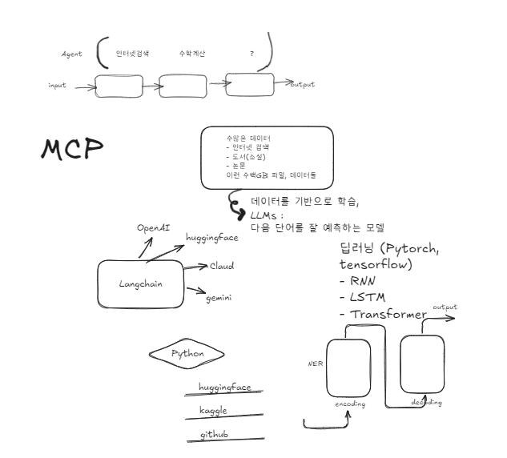

딥러닝 잘 다루는 모델 : pytorch, tensorflow

input > () > output

# 대형 언어 모델(Large Language Model, LLM):
방대한 양의 텍스트 데이터를 기반으로 학습된 딥러닝 모델로, 다양한 자연어 처리 작업에 활용
예측모델이라 자연어기반

agent 통신: MCP(Message Communication Protocol, 텍스트 기반의 메세지 교환 형식)
2025년 키워드
