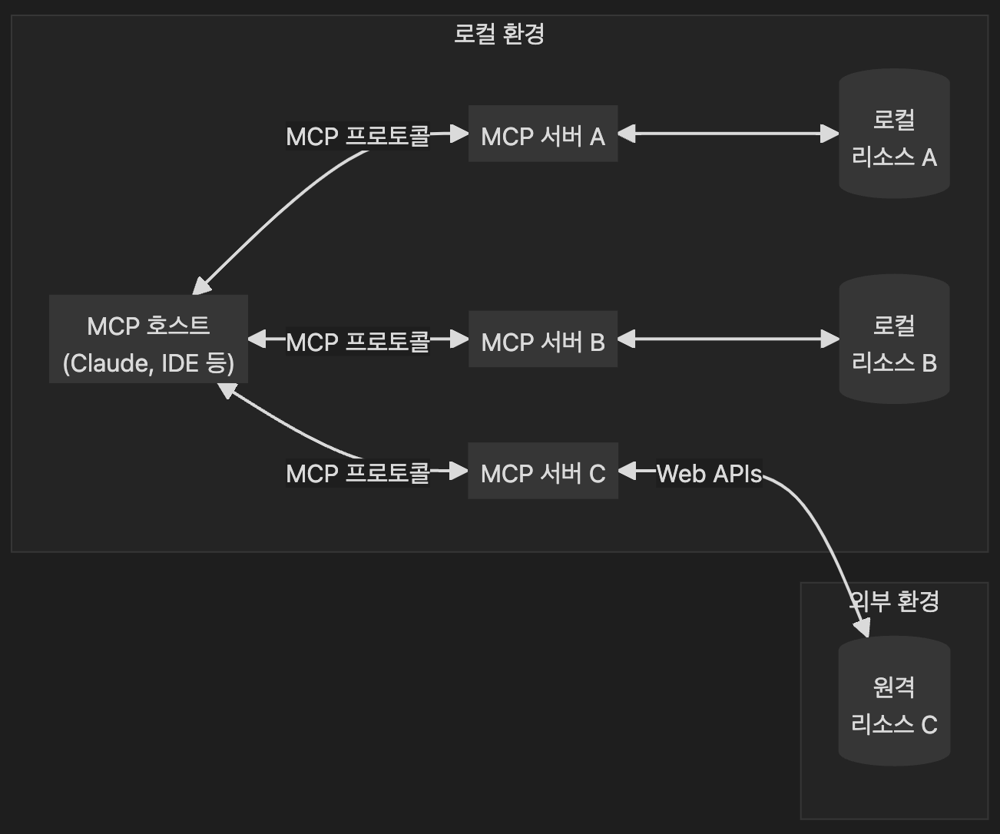

# MCP (Message Communication Protocol) 개요

- 우리가 알아야하는 MCP는 Model Context Protocoal
  정의: MCP는 텍스트 기반 네트워크 환경(특히 텔넷 기반 MUD 게임)에서 클라이언트와 서버가 표준 텍스트 스트림을 손상시키지 않으면서도 구조화된 메타 데이터를 주고받을 수 있도록 설계된 프로토콜입니다.

- 주 용도: 일반 출력 스트림과 별개로, 구조화된 메시지를 전송하여 클라이언트 기능(예: GUI, 스크립트 기능)을 확장하는 데 사용됩니다.
- 직접적으로는 안쓰고 JSON, REST API, gRPC, WebSocket 같은 표준 메시지 포맷과 전송 프로토콜을 사용

## 주요 특징

| 항목                | 설명                                                                    |
| ------------------- | ----------------------------------------------------------------------- |
| **텍스트 기반**     | MCP는 기본적으로 텍스트를 사용하며, 기존 텔넷 기반 통신을 침해하지 않음 |
| **메시지 기반**     | `#`로 시작하는 특별한 메시지 형식을 사용                                |
| **클라이언트 확장** | MCP-aware 클라이언트가 GUI 창 제어, 데이터 처리 등을 가능하게 함        |
| **세션 협상**       | MCP는 핸드쉐이크로 세션을 협상하고 인증할 수 있음                       |
| **명령 구조화**     | 키-값 쌍 또는 구조화된 메시지 형태로 명령을 전달함                      |

## 메세지 예시

1. 세션 핸드쉐이크
2. 메세지 전송
3. 다중 줄 메세지

## 프로토콜 협상

서버가 MCP를 지원하면 클라이언트에게 MCP 세션을 제안하고, 클라이언트가 지원할 경우 핸드셰이크를 통해 MCP 통신을 시작합니다. 이 때 인증 토큰 또는 session key를 설정해 후속 메시지와 연결합니다.

## MCP와 LLM 또는 LangChain?

MCP는 개념적으로 멀티에이전트 간의 구조화된 메시지 교환 방식으로 볼 수 있고, 요즘은 그 유사 개념들이 Agent Communication Protocol (ACP) 이나 LangChain의 Tool 인터페이스에서 재해석되어 쓰이고 있습니다.

# 우리가 쓰는 MCP - Model Context Protocol(MCP)

- 애플리케이션과 외부 데이터 소스 및 도구들 간의 원활한 통합을 가능하게 하는 개방형 프로토콜입니다. AI 기반 IDE를 구축하든, 채팅 인터페이스를 개선하든, 혹은 커스텀 AI 워크플로우를 만들든 관계없이, MCP는 LLM이 필요로 하는 컨텍스트와 연결하기 위한 표준화된 방법을 제공합니다.

## MCP(Model Context Protocol)

1. JSON-RPC 기반 통신

- 표준 JSON-RPC 2.0 메시지 포맷 사용
- 상태 기반 연결 관리
- 서버와 클라이언트 간 능력 협상

2. 보안 중심 설계

- 사용자 동의와 제어를 최우선으로 고려
- 데이터 프라이버시 보호
- 도구 사용에 대한 명시적 승인 필요

3. 유연한 확장성

- 다양한 리소스 타입 지원
- 커스텀 도구 및 프롬프트 정의 가능
- 표준화된 방식의 기능 확장

## 개발 철학

MCP의 개발은 다음과 같은 철학을 바탕으로 합니다:

1. 개방성

- 오픈 프로토콜로 제공
- 커뮤니티 주도 발전
- 표준화된 확장 방식

2. 안전성

- 사용자 중심의 보안 모델
- 명시적 권한 관리
- 데이터 보호 우선

3. 실용성

- 실제 사용 사례 중심 설계
- 구현 용이성 고려
- 효율적인 통신 구조

## 기본 아키텍처

**MCP 라이브러리 찾아보기**

## [ref]('https://wikidocs.net/268795')

## [MCPdocs]('https://modelcontextprotocol.io/introduction')

## [ClaudeMCP]('https://www.anthropic.com/news/model-context-protocol')
