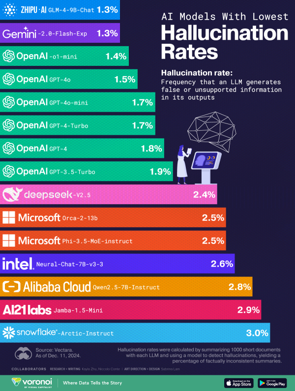

# LLM Models

- OpenAI 사의 chatGPT
- Anthropic사의 claude
- Google 사의 gemini 

- cursor.com
- kling.ai
- leonardo.ai
- gamma.ai

로컬 설치
llama


개인
huggingface

통합
Langchain

### Langchain에서 pipline

파이프로 || 연결시킴

```Python
chain = 전처리 | 모델 | 후처리
chain = 전처리 | 모델 | 후처리 | 모델 | 후처리
chain = 전처리1 | 전처리2 |  모델1 | 후처리1 | 후처리2 
```


### fine-tuning

gpt-3.5 - instruct (시키기 위한 것)
- instruction 을 주고 명령을 시킬때 쓰기 좋은 모델

gpt 3.5 - turbo (q&a)

gpt-4o


### 할루시네이션(Hallucination)
- LLM이 사실이 아닌 정보를 생성하거나 학습데이터에 없는 내용을 만들어내는 현상
- ex. 2024, 9, 11


학습을 시키고(틀림을) :사실 배우진 않음
세션 내에서 기억하고 기반으로 답변해줌: short-term memory (세션)

long-term memory (기억)
지우라고 알려주거나
설정에서 지우면 된다.
메모리 저장 X 를 한다


