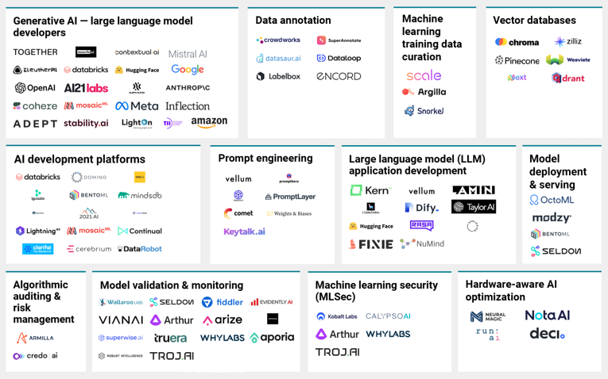

## [LangChain Docs]('https://python.langchain.com/docs/introduction/')

## [LangChain Python API reference](https://python.langchain.com/v0.2/api_reference/index.html)

## [Langchain Ecosystem]('https://js.langchain.com/v0.1/docs/ecosystem/')

## 