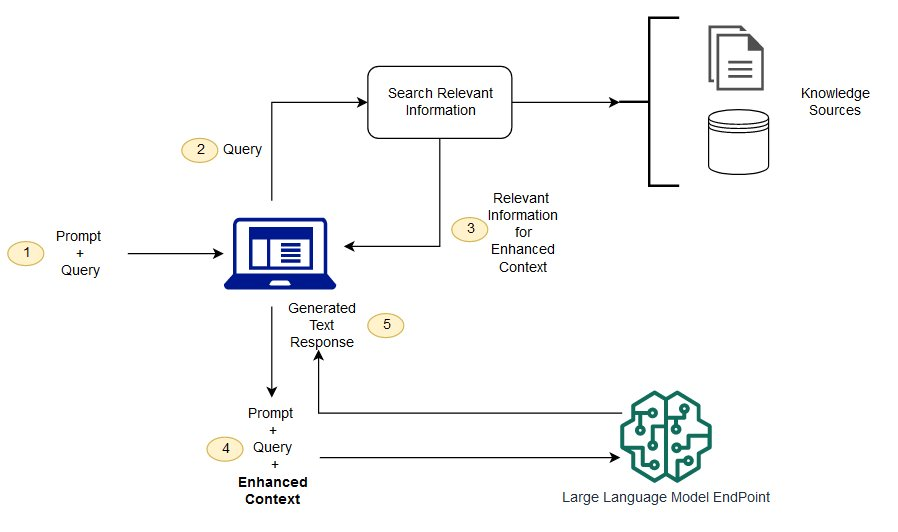

# RAG (Retrieval-Augment Generation)

- 검색-증강 생성
- 대규모 언어모델의 출력을 최적화하여 응답을 생성하기 전에 학습 데이터 소스 외부의 신뢰할 수 있는 지식 베이스를 참조하도록 하는 프로세스
-

- 대형 언어 모델은 현재 상황에 대한 최신 정보를 얻기를 거부하지만 항상 절대적인 자신감을 가지고 모든 질문에 답변하는 지나치게 열정적인 신입 사원으로 생각할 수 있습니다. 안타깝게도 이러한 태도는 사용자 신뢰에 부정적인 영향을 미칠 수 있으며 챗봇이 모방하기를 원하지 않습니다! (출처 : AWS)

## RAG의 주요 구성 요소

- 질의 인코더(Query Encoder): 사용자의 질문을 이해하기 위한 언어 모델입니다. 주어진 질문을 벡터 형태로 인코딩합니다.

- 지식 검색기(Knowledge Retriever): 인코딩된 질문을 바탕으로 외부 지식 베이스에서 관련 정보를 검색합니다. 예를 들어 Wikipedia, 뉴스 기사, 전문 서적 등 방대한 문서 집합에서 질문과 연관된 문단이나 구절을 찾아냅니다.

- 지식 증강 생성기(Knowledge-Augmented Generator): 검색된 지식을 활용하여 질문에 대한 답변을 생성하는 언어 모델입니다. 기존의 LLM과 유사하지만, 검색된 지식을 추가 입력으로 받아 보다 정확하고 풍부한 답변을 생성할 수 있습니다.

- 구글의 LaMDA, OpenAI의 WebGPT

## RAG 기술을 적용한 상용 서비스 사례

RAG 기술을 적용한 상용 서비스는 아직 많지 않지만, 몇몇 대표적인 사례들이 있습니다.

1. Microsoft Bing Search

- 2023년 2월, Microsoft는 Bing 검색 엔진에 RAG 기술을 적용한 대화형 AI 기능을 추가했습니다.
- 사용자의 검색 질의에 대해 웹 페이지의 정보를 활용하여 자연어로 응답을 생성합니다.
- 제공된 응답의 근거가 되는 웹 페이지 링크를 함께 제시합니다.

2. Anthropic’s Constitutional AI (CAI)

- Anthropic사는 RAG 기술을 활용한 대화형 AI 모델인 CAI를 개발했습니다.
- CAI는 대화 과정에서 외부 지식을 활용하여 사용자의 질문에 답변을 생성합니다.
- 생성된 응답의 근거가 되는 출처를 명시하여 신뢰성을 높였습니다.

3. Perplexity AI

- Perplexity AI는 RAG 기반의 질의응답 서비스를 제공하는 스타트업입니다.
  사용자의 질문에 대해 웹 검색을 통해 관련 정보를 수집하고, 이를 바탕으로 응답을 생성합니다.
- 제공된 응답의 출처와 검색 과정을 사용자에게 투명하게 공개합니다.

4. OpenAI’s WebGPT (in development)

- OpenAI는 GPT 모델에 RAG 기술을 적용한 WebGPT를 개발 중입니다.
  WebGPT는 웹 검색을 통해 획득한 지식을 활용하여 사용자의 질의에 대한 응답을 생성할 것으로 예상됩니다.
- 아직 공개된 서비스는 아니지만, 향후 RAG 기술의 발전 방향을 보여주는 사례로 주목받고 있습니다.
  위의 사례들은 RAG 기술의 초기 적용 단계라고 볼 수 있습니다. RAG의 잠재력이 입증됨에 따라 앞으로 더 많은 분야에서 RAG 기반의 서비스들이 등장할 것으로 예상됩니다. 특히 검색 엔진, 가상 어시스턴트, 고객 서비스 등의 분야에서 RAG 기술이 활발히 도입될 것으로 보입니다.
