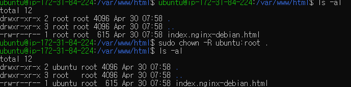

# chown
```shell
chown [-R [ -H | -L | -P ]] [ -h ] owner[:group] file ...
chown -R  [  -f ] [ -H | -L | -P ] Owner [ :Group ] { File ... | Directory ... }
```
기본적으로 chown은 기호 링크를 따르고 기호 링크가 가리키는 파일의 소유자 및 그룹을 변경합니다.
파일의 그룹은 파일의 소유자와 같을 수 없습니다.

옵션

-H
    -R 옵션이 지정된 경우, 명령행의 기호 링크를 따릅니다. 트리 조회에서 발견된 기호 링크는 따르지 않습니다.
-L
    -R 옵션이 지정된 경우, 명령행의 기호 링크와 트리 조회에서 발견된 기호 링크를 모두 따릅니다.
-P
    -R 옵션이 지정된 경우, 기호 링크를 따르지 않습니다.
-R
    파일이 디렉토리를 지정하는 경우, chown은 해당 위치에 연결된 전체 서브트리에서 각 파일의 소유자 및 그룹을 반복적으로 변경합니다.
-h
    기호 링크가 가리키는 파일 대신에 기호 링크의 소유자 및 그룹을 변경합니다.

### Files

Item  | Description
/usr/bin/chown	| The chown command
/etc/group	| File that contains group IDs
/etc/passwd	| File that contains user IDs

