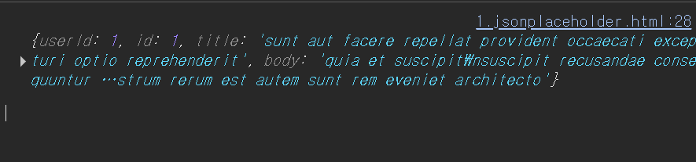

# promise

## response 값
- pending
- fulfilled : 성공/끝났음
- rejected : 실패
- fullfilled 가 됐을때 .then((response))

이 변수에 담겨온 response라는 타입의 객체다.



https: 주세요
GET method 로 요청을 한것
domain : ~~~.com
path : /post/1

그래서 오는 응답값들은 어떤게 있을까?

- 100 : 정보(info)
- 200 : 응답 성공 ex) 200, 201
- 300 : 리다이렉트
- 400 : 클라이언트 오류
- 500 : 서버 오류


http response status mdn 또는 http rfc

```sh
curl -I 
```


메세지를 가져와서 처리하는 과정을 파싱이라 한다.


### JSON(JavaScript Object Notion) : 자바스크립트 객체 포맷 |  문서의 포맷
json으로 파싱되
- Key, Value 형태


csv(comma sepearted value)
kim, john, 
 
 
Graphics Interchange Format; GIF


jpg format header


XML : 태그 형태


```html

<!DOCTYPE html>
<html lang="en">
<head>
    <meta charset="UTF-8">
    <title>Document</title>
</head>
<body>
    <h1>외부 서버로부터 데이터 가져오기</h1>
    <div id="result">
        <!-- 가져온 데이터 표시할 곳-->

    </div>
    
    <script>
        //const ret = fetch('https://jsonplaceholder.typicode.com/posts/1')
        //console.log(ret);// Promise 객체타입
        // //비동기 처리 : 기다리지 않고 끝나면 알려줘
        //pending 이따가 할거다
        // 200 요청 완료

        fetch('https://jsonplaceholder.typicode.com/posts/1')
            .then(response => {
              //  console.log(response.status); //200
               // console.log(response.ok); //성공 실패 여부 true/false
                return response.json(); // Response 객체를 response 라는 변수에 담아서 왔는데 
                // 그 변수 안에 있는 객체의 json이라는 함수를 통해서 실제 데이터로 변환
            }).then((data) => {
                console.log(data);
            })
        //then이라는 함수 , 이벤트랑 비슷한 response
    </script>
</body>
</html>
```
