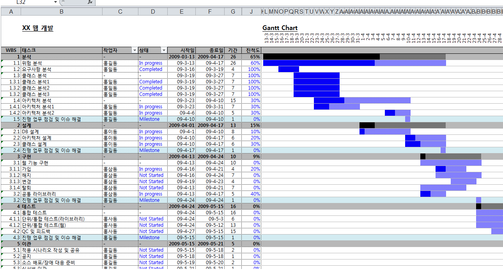

# JavaScript

프론트엔드용 JS : 
LiveScript > JavaScript


JS: 시작부터 끝까지 다 브라우저 내에서만 돌아감


C, Java, Python 모든 것은 브라우저에서 돌아가지 않고 JS가 유일하다
TS(TypeScript)도 브라우저에서 돌아가지 않음

---

변수 안에 무언가 할당
각종 조건에 따라서 연산(if, for, while, swith)

CPU에서 처리 , 메모리(MEM), 저장소(디스크)

---
Node.js (백엔드용 JS)

JavaScript

Python

---
JavaScript

int
let


C
int main() {
    print('hello, world');
}

gcc -o hello hello.c


CPU가 인식하는 건 기계어
INPUT >> 프로세싱 >> OUTPUT

- Data (Integers, Reals, Text)
- CPU Instructions (i.e. Computer programs)
- Memory Addresses ("Pointers" to data or instructions)


| 참고 영화 : 히든 피겨스

### 어셈블러
0100100100 ADD <br>
0000001111 SUB

Cobol(코볼) : 항공예약시스템, 뱅킹


| [Memory 참고 자료]("https://www.doc.ic.ac.uk/~eedwards/compsys/memory/index.html")

- 컴파일러 (C언어 -> 어셈블리어) 
- 어셈블리어 1:1 기계어

### 컴파일

- 기계어로 바뀌는게 컴파일
- 스크립트언어는 컴파일 X
- ex) JavaScript, LiveScript
- 특징 : 문법의 오류가 있다면 실패, 한줄 한줄 실행 되지만 틀리면 실행이 안됨 > 에러를 모르다가 컴파일 시점에 알게 되는 것


### 컴파일 언어
Java
hello.class > JVM > 기계어

JavaScript
브라우저


## JavaScript 배우기

- var(variable)

-  indent : 
python은 indent 중요함
indent 중요하지 않음 : C, Java, JavaScript


undefind : return 값이 없어서 나오는 값


사용자가 버튼을 클릭해서 상품을 장바구니에 담아서 결제한다.
1. 사용자가 버튼을 클릭한다.
   - 함수_사용자버튼클릭()
2. 상품을 장바구니에 담는다.
   - 함수_상품장바구니()
3. 결제한다.
   - 함수_상품장바구니()


4. 전체로직함수 {
    함수_사용자버튼클릭()
    함수_상품장바구니()
    함수_상품장바구니()
}

## 반복문 (for)

for(var i = 1;i <= 5; i++) {

}

for (초기값; 반복조건; 변수증감) {
    실행하고 싶은 것
}

변수증감 없다면 무한 반복


JS 엔진(VM) 조그0만한 가상의 연산장치(CPU, MEM)


### 언어별 콘솔 차이
C
print("hello world");

Java
System.out.println("hello world");

JavaScript
console.log("hello world");


## 반복문 (while)
while(조건문) {
    조건문이 참이면,
    여기 내용 반복 수행
}


## 함수(function box)
function greeting(name) {
    console.log("Hello, ", name);
}


## 모던 JS 문법
1. JS는 변수에 함수 할당도 가능함
```JavaScript
const add = function(a,b) {
    return a+b;
}

console.log(add(2,5));
```

- C언어에서 온 문법
- 원래 프로그래밍 언어가 아니여서 (브라우저에서 연산 프로그래밍으로 출발한건데) 유연성이 너무 큼(자꾸 커짐)
- 이 유연성을 제한하자. >> TypeScript 언어 개발
- facebook typeScript 제한을 너무 줘서 안쓰기로 함(25.04)

2. 브라우저에서 돌아가는 것이다.
space = 1byte


만약 
1000byte : 가독성좋게 한다면, indent, space넣음
850byte : 네트워크 비용 절감됨 minifying(공백없음)

- naver는 minifying함
- coopang은 minifying안함
- tool을 사용해서 압축

## Arrow Function
```JavaScript
const add = (a,b) => a+b;
```
ㄴ arrow function

- 위아래 같은 것

```JavaScript
const add = function(a,b) {
    return a+b;
}
```
ㄴ 익명함수(anonymous function)


```JavaScript
const add = (a,b) => {console.log(a); consolog.log(b); console.log(a+b); return a+b;}
```


## 객체(Object)
여러가지 값을 모아둔 것
여러가지 속성을 담을 수 있음
객체 내부 변수에 문자열, 숫자도 담음

```JavaScript

var person = {
    name:'john',
    age:25
}


person.name
person.age

console.log("사람의 이름은:", person.name);
console.log("사람의 이름은:", person.age);
```


console 은 객체, log의 함수였던 것

```JavaScript

var person = {
    name:'john',
    age:25,
    greet: function() {
        console.log("안녕하세요, 저는 " + this.name + "입니다");
    }
}


```

- 함수call (부른다 호출한다)
  - ex) person.name, person.age
  - ex) person.name(), person.age(), log()
  - ex) person["name"], person["age"]


## 자료구조

숫자, 문자
목록 : 배열(array), 리스트

```JavaScript

var fruits = ["사과", "오렌지", "딸기"]

```


- 여기서 (3)은 출력 안됨
- list는 처음 0부터 시작(index)

![list[index]](image-17.png)


- 메모리 안 주소값, 값(요소)이 있는데 여기서 0부터 출발해서 index가 0부터 출발함


- push() : index 반환
- pop() : 끝 요소가 반환


- 전통적인(레거시) 반복문
```JavaScript
for(var i=0; i <3; i++) {
    console.log(fruits[i]);
}
```


## 모던 문법 반복문
1.
```JavaScript

fruits.forEach(function(number) {
    console.log(number);
})
```


2. 가장 많이 쓰임
```JavaScript
fruits.forEach((number) => {
    console.log(number);
});

```

3. 한줄로 간소화 가능
```JavaScript
fruits.forEach((number) => console.log(number));
```


### global object(전역객체)
- console(Debugging 창, 개발자 도구 창), document(DOM 문서), navigator(브라우저)


- location(브라우저의 주소창, 새로고침할때)
    -location.reload()
- window.width
- history.back() (브라우저의 방문기록, 뒤로가기)


## getElementBy ~ 
다외우기


ClassName으로 가져오면 리스트로 가져온다.(자료구조 중 Collection)


할당 / 정의(define, assign = assignment)
- 비교문 ==
- 글자, 숫자 값, 타입 비교  === 

0 : 숫자 / 글자


### const(고정된 값, 불변)
- 상수(constant)를 변수로 정의하는게 좋다
- 다 대문자로 쓰기
- 축약가능
  
### var(변수, 전역스코프)
- variable
  


### let(변수, 블록스코프)