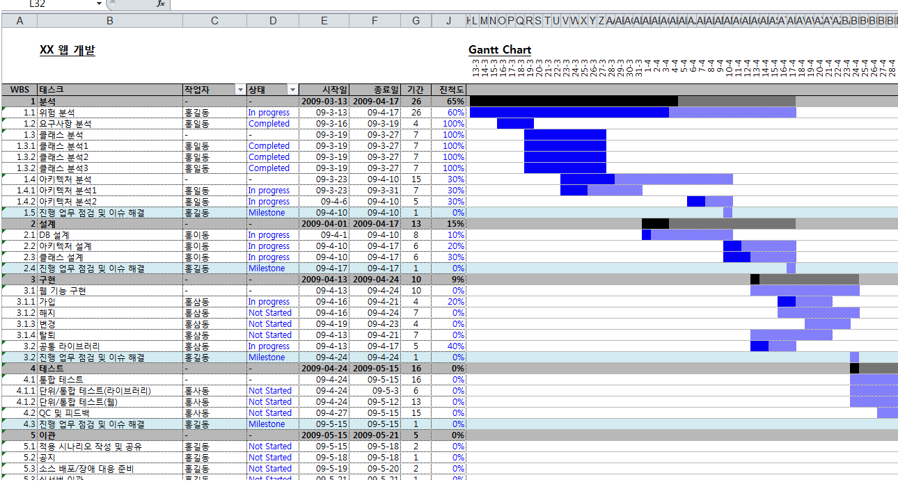

## 중요개념

DOM 제어가 가장 중요함

프로듀서(정보를 게시)
컨슈머(정보를 소비)

기술적인 내용은? 게시판 CRUD 가 끝이다.

대용량 처리 등을 어떻게 할 것인지 

## Fetch요구사항

요구사항은 최대한 간결하게 나눈다. task 분할
내가 뭐하는지, 다른 팀원이 뭐하는지(jira)
Jira : 간트차트
wbs. 검색하면 간트, 업무 분류 체계 또는 작업 분해 구조를 뜻합니다.

- 프로젝트의 목표를 달성하기 위해 필요한 업무를 세분화한 구조로, 프로젝트 관리에 사용되는 문서입니다.

1. 버튼을 두개 만든다.
2. 1-1. 버튼 1개 만들기 : Load Data
3. 1-1-1. 파란색으로 디자인한다.
4. 
5. 1-2. 두번째 버튼 만든다. : clear
6. 1-2-1. 빨간색으로 디자인한다.(dependency)

2. 데이터를 로딩해서 바튼 아래 데이터를 표시한다.
3. 2-1. 데이터를 로딩한다.
4. 2-1-1. 데이터 어디서 가져옴? :jsonplaceholder
5. 2-2. 버튼 아래 표시한다.
6. 2-2-1. 어디에 표시 : 버튼 아래 공간을 만들어서 표시(div만들고 추가)

3. clear를 통해 데이터를 삭제한다.

디테일 디자인
7. 4. 로딩 상태 또는 clear 상태 표현한다.
8. 4-1. 로딩 상태 표현
9. 4-1-1. 로딩할때 bootstrap의 spinner형태로 진행상황 표시
10. 4-1-2. 로딩이 끝나면 spinner 제거
11. 4-1-3. 로딩중일 때 버튼 중복 클릭 방지
12. 4-2. 클리어 상태 표현
13. 4-2-1. 클리어할때 bootstrap의 spinner로 진행상황 표시
14. 4-2-2. 클리어중ㅇ일때 버튼 중복 클릭 방지
15. 4-2-3. 데이터가 없을때는 클리어 불가

5. 쓸데없는 사용성 개선, 클리어 너무 빨라서 안보이니 지연 로딩 넣기
6. 5-1. clear 1초 지연했다가 처리

- 기다렸다가 사용하는 함수는 ? > setTimeout(호출될 함수, 기다릴 시간)

