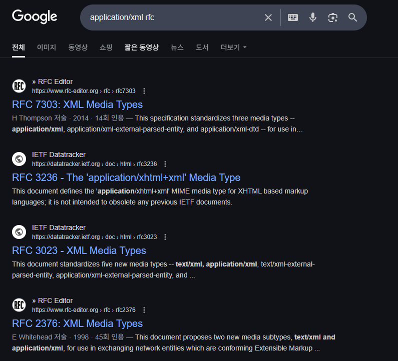

# axios
## [axios]('https://axios-http.com/kr/docs/intro')


### 예제
[실행결과](./image/image.png)
```js
    <script>
        document.getElementById('loadDataBtn').addEventListener('click', async () => {
            try{
                const response = await axios.get('1https://jsonplaceholder.typicode.com/posts/1');
                const data = response.data;

                document.getElementById('result').innerHTML = `
                    <p><strong> 타이틀 : </strong> ${data.title}
                    <p><strong> 본문: </strong> ${data.body}
                `
            }catch(error) {
                document.getElementById('result').innerHTML = `
                    <p>오류가 발생했습니다. </p>
                `
            }
        });
        //fetch POST 를 axios로 변경한다.
        
    </script>
```


