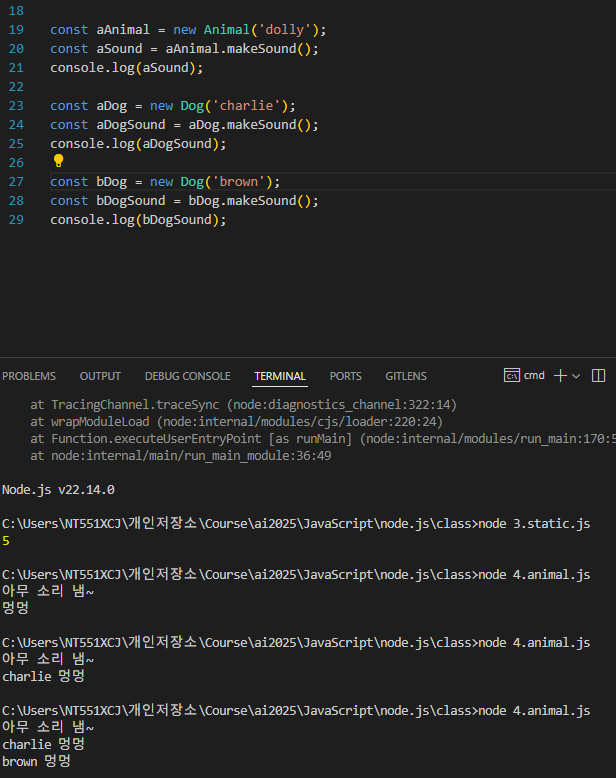

# 객체

persion ={} JSON 노테이션으로 작성한 자료구조 Object(객체)

지금 배우는 객체는 객체지향의 객체(class)


객체 생성에서 new 를 쓰지 않는 것 : 객체 내부에  static(정적) 메서드를 접근할 때 
Math.PI 같은 어느 객체든 공통적인 값들, 함수들을 
static 변수, static 함수로 정의한다고 한다.
이때는 new 없이 접근이 가능함


## JS를 객체지향적으로 만들기(OOP)
- ES6 (2015)


class 를 만든다.
1. constructor로 초기값을 생성한다(Optional)
2. class로 객체를 만들때는 new 를 사용해서 개별 객체를 만들고 함수(method/function)를 사용한다.

3. get/set 키워드를 통해서 getter, setter를 만든다.
이유는 객체 내부의 변수에 값을 저장하거나 가져오게 하기 만들기 위해서(직접 접근하는 것은 좋지 않음, 그러나 해도 되긴 함)

4. static 함수를 통해서 new 를 하지 않고 호출이 가능한 함수도 있다.




```JavaScript
class Animal {
    constructor(name) {
        this.name = name;
    }

    makeSound() {
        return "아무 소리 냄~";
    }
}

class Dog extends Animal {
    //상속(inheritance) >> 확장된 개념
    makeSound() { //함수의 overriding, 부모함수를 그대로 또는 재정의해서 사용
        return `${this.name} 멍멍`;
    }
}

class Cat extends Animal {
    makeSound() {
        return `${this.name} 냐 ~~ 옹`;
    }
}

// 1. 
const aAnimal = new Animal('dolly');
const aSound = aAnimal.makeSound();
console.log(aSound);
// 2.
const aDog = new Dog('charlie');
const aDogSound = aDog.makeSound();
console.log(aDogSound);

const bDog = new Dog('brown');
const bDogSound = bDog.makeSound();
console.log(bDogSound);


const aCat = new Cat('Kitty');
const aCatSound = aCat.makeSound();
console.log(aCatSound);
````


예시 2)
```Java
class Person () {
    int id;
    string name;
    int age;
}


class Student extends Person() {
    int fee;
    string subject[];
}


class Professor extends Person() {
    int salary;
    string subject[];
}


```

## OOP 만드는 방법 -JS

1. 하나의 파일로 객체지향으로 잘 짠다.
2. 분리/분할해서 파일마다 기능 쪼개기
3. 불러오기 require 사용 / 내보내기 export 사용 (필요한 객체들을 내보내고 받는다.)