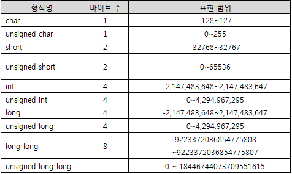

# Computer Science

## Memory

8bit 저장 

000000000 = 0
111111111 = 255

64비트 (2의 64승 등 크기의 한계가 있음)

부호비트
sign bit로 변경

-1 
0 : 양수
1 : 음수

-127  ~ 127

int
unsigned int

[C언어]('https://wikidocs.net/165675')
- 모던 언어인 Python, JavaScript는 알아서 해줌(메모리 값이 싸져서)

## Overflow <> UnderFlow
overflow라는 타입을 초과하는 경우
underflow : 변수나 메모리의 저장 용량보다 작은 값을 저장하려고 할 때 발생하는 상황을 말합니다.

큰단위의 비트코인 거래소, 증권 거래소는 이런 일을 한다.

