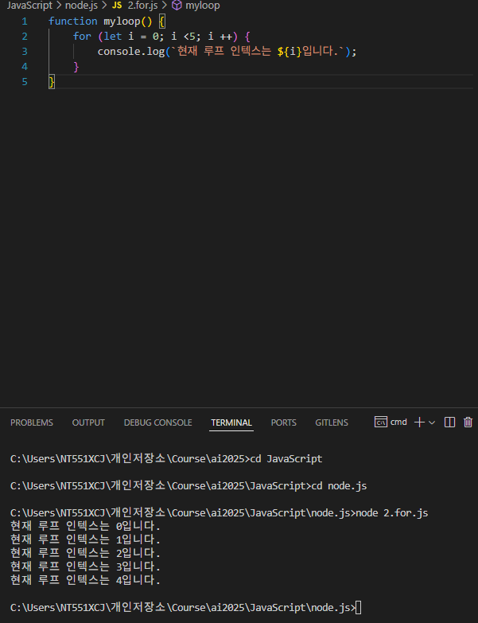

# node.js


## 기본 return 값 : undefinded
- console.clear(); 삭제




![typeof]](image-7.png)


-- Math 함수 


ctrl + C : 깅제종료
ctrl + D: 새출발 node
.exit

.help


0 and 0 =0
0 and 1 =0
1 and 0 =0
1 and 1 = 1


0 or 0 = 0
0 or 1 = 1
1 or 0 = 1
1 or 1 = 1


```JavaScript

console.log(5 + 2 === 7 && 4 > 5 || 'Hi' === 'Hi'); //답 true
````
 + === && > || ===
5 + 2 === 4 > 5 === 5
5 + false > true
5 > false
true


1. ||
2. &&
3. ===
4.  >
5.  +


https://developer.mozilla.org/ko/docs/Web/JavaScript/Reference/Operators/Operator_precedence


a = 5; // 101 === 0101
b = 3; // 11  === 0011
a & b
0101 & 0011

