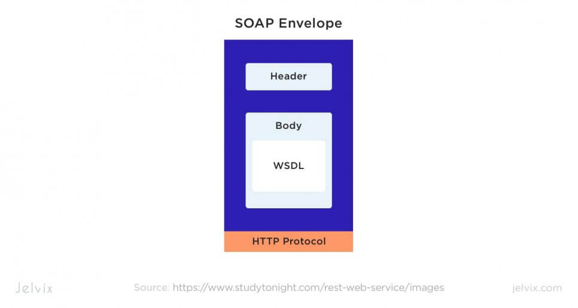
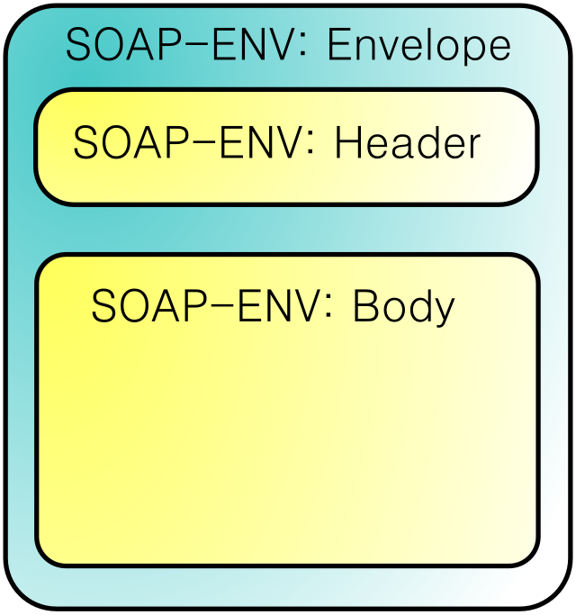
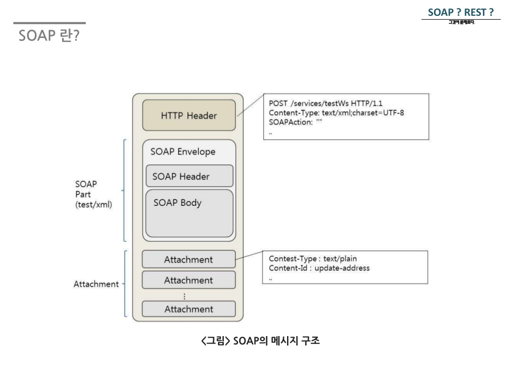
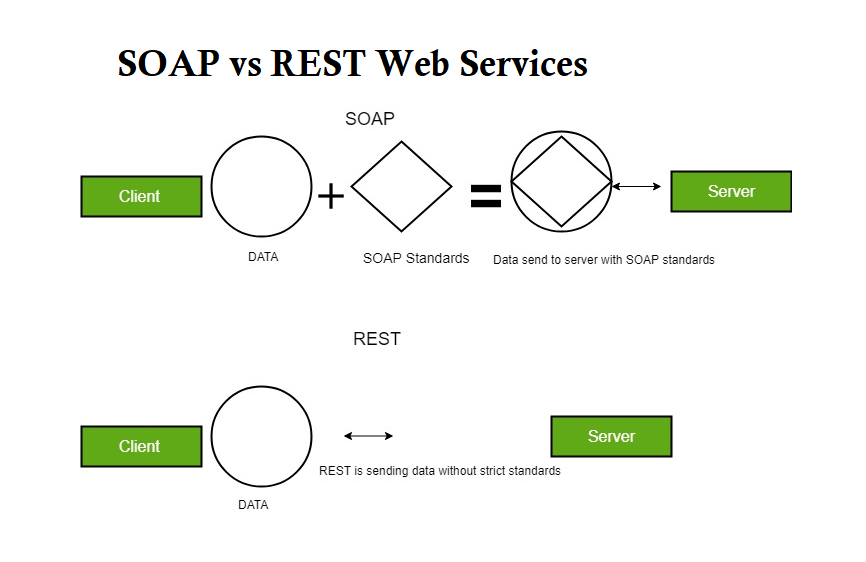
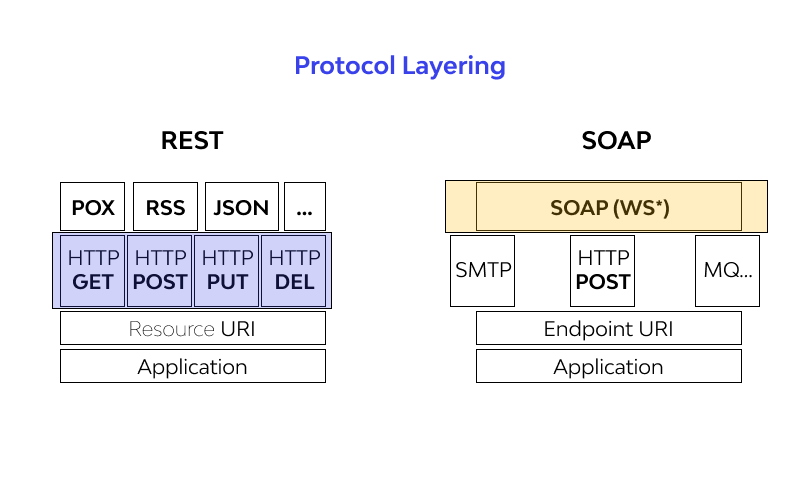
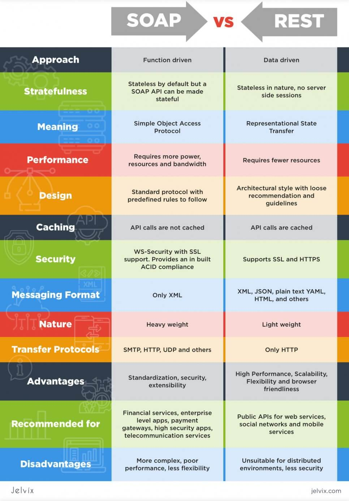
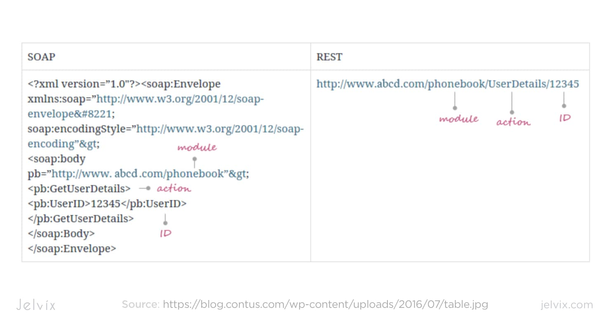

# SOAP(Simple Object Access Protocol)

- HTTP, HTTPS, SMTP 등을 통해 XML기반의 메세지를 컴퓨터 네트워크 상에서 교환하는 프로토콜이다.
- SOAP 메시지는 일반적으로 HTTP 또는 JMS를 통해 전송되지만 다른 전송 프로토콜을 사용할 수 있습니다. 특정 웹 서비스에서 SOAP을 사용하는 것은 WSDL 정의에서 설명됩니다.

## 핵심 원칙
- SOAP는 통신을 용이하게 하기 위해 잘 정의된 구조에 의존합니다. XML만을 사용하여 메시지를 형식화함으로써 일관성과 호환성을 보장합니다. 이 프로토콜은 세 가지 핵심 원칙을 따릅니다:

- 봉투(Envelope): 메시지의 모든 데이터를 캡슐화하고 SOAP 메시지로 식별합니다.
- 헤더(Header): 인증 세부 정보와 같은 추가 메타데이터를 제공합니다.
- 본문(Body): 클라이언트와 서버 간에 교환되는 실제 메시지 내용을 포함합니다.

이 구조화된 접근 방식은 복잡한 기업 수준 애플리케이션에 이상적입니다.

## 구문 규칙

다음은 몇 가지 중요한 구문 규칙입니다.

SOAP 메시지는 XML을 사용하여 인코딩되어야 합니다.
SOAP 메시지는 SOAP Envelope 네임스페이스를 사용해야 합니다.
SOAP 메시지에는 DTD 참조가 포함되어서는 안 됩니다.
SOAP 메시지에는 XML 처리 지침이 포함되어서는 안 됩니다.

## SOAP vs REST 

SOAP는 프로토콜로 작동하며 데이터 교환을 위해 XML만 사용합니다. 이 엄격한 구조는 일관성을 보장하지만 복잡성을 증가시킵니다. 반면, REST는 JSON, XML, 일반 텍스트 등 여러 형식을 지원하는 아키텍처 스타일을 채택합니다. 특히 JSON은 경량화되어 널리 사용되며, REST API를 현대 애플리케이션에 더 효율적으로 만듭니다.

## ref
[SOAP - 얄코]('https://www.youtube.com/watch?v=5o1IiHuUxPk')