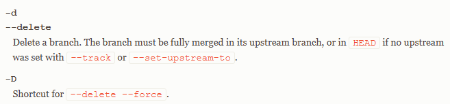

# -d 와 -D 옵션의 차이

## -d : --delete

-d는 --delete의 약자이며 위 명령어에 추가할 수 있는 선택적 플래그입니다. 무언가를 삭제하고 싶다는 의미를 담고 있는 플래그입니다.

## -D : --delete --force

대문자 "D"가 있는 -D 플래그는 --delete --force(강제 삭제)의 줄임말이며, 병합 여부와 관계없이 로컬 브랜치를 강제로 삭제합니다.
브랜치 삭제 여부를 재확인하는 절차가 따로 없으므로 이 명령어는 주의해서 사용해야 합니다.
로컬 브랜치를 확실히 삭제하려는 경우에만 사용해야 한다는 점을 잊지 마세요.
다른 브랜치로 변경 이력을 병합하거나 코드 베이스의 원격 브랜치로 푸시하지 않은 상태에서 로컬 브랜치를 삭제하면 변경 사항이 손실될 위험이 있습니다.

# 원격 브랜치 삭제

## git push <원격 저장소 이름> -d <원격 브랜치 이름>

# 원격 브랜치 모두 확인

## git branch -a

### 주의점 및 궁금점

- q) 원격 브랜치를 먼저 삭제 후 로컬 브랜치를 삭제해야하는가? a) X : 로컬 삭제후에 원격 삭제도 가능하다
- q) 로컬 브랜치 따서 아무것도 안한 후에 원격으로 push 했으면 로컬 branch 삭제시 -d 명령어가 안되는가? a) X : push하면 remote 에 올라간 것이기 때문에 로컬에서, 원격에서 다 지워도 상관없다.
- q) github 사이트에서 원격 브랜치를 삭제 후에 로컬에서 git remote update 했을시, 삭제한 git branch가 왜 origin에 남아있는걸로 확인될까?
