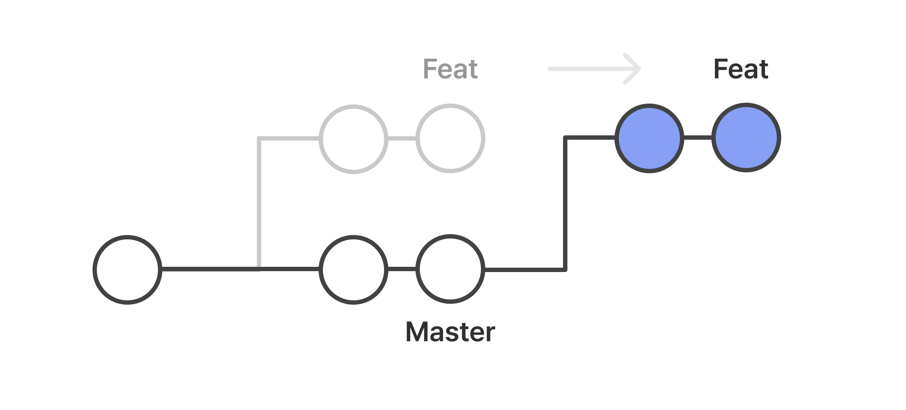

# Create a merge commit, Squash and Merge, Rebase and Merge 차이

## Create a merge commit

- 이 옵션을 선택하면 GitHub는 PR branch와 base branch의 변경 내용을 하나의 새로운 병합 커밋으로 합칩니다.
- 이 병합 커밋은 base branch에 추가되어 변경 내용을 별도로 추적할 수 있게 합니다.
- 이 방법을 사용하면 변경 내용이 base branch에 항상 추가되므로 변경 내용의 흐름을 추적하기 쉽습니다.
- 하지만 이렇게 병합하면 커밋 히스토리가 더 복잡해질 수 있고, 다수의 작은 병합 커밋이 쌓일 수 있습니다.

## Squash and merge

- PR에 존재하는 모든 커밋들을 1개의 commit으로 결합하여 base branch로 머지합니다.
- 많은 커밋 기록들을 하나의 커밋으로 묶어서 관리하기 위한 머지 전략입니다.

### Squash and merge 방법

1. 커밋을 스쿼시 하는데 사용되는 대화형 도구인 `git rebash -i`
2. 병합하는 동안 -squash 옵션을 사용해 `git merge -squash`

### 1- 대화형 git rebase 도구를 사용하여 Git 커밋 스쿼시

```bash
$ git log --pretty=oneline

```

1. commit 확인 및 id 확인

```plain text
ex)
25c38c4 remove .class files
da66e6a Delete version.ini
f4e3f09 Delete .log
b0e6655 Delete .lock
da66e6a github git notes
```

2. 대화형 git rebase 도구 사용하기

```bash
git rebase -i [id값]
```

- 남길(base) , 되돌아갈 커밋 id를 명시

3. 편집기
   - rebase를 통해 commit 이전 상태로 되돌아가려는데 남아있는 commit들을 어떻게 처리할 거냐고 Git이 물어보면서 사용 가능한 Command를 알려준다
   - 여기서 첫번째 pick빼고 나머지를 pick을 지우고 s(squash)를 써준 후 편집기를 저장, 종료한다.

```plain text
pick b0e6655 Delete .lock
pick f4e3f09 Delete .log
pick da66e6a Delete version.ini
pick 25c38c4 remove .class files

# Rebase 652d2fe..25c38c4 onto 652d2fe (4 command(s))
#
# Commands:
# p, pick = use commit
# r, reword = use commit, but edit the commit message
# e, edit = use commit, but stop for amending
# s, squash = use commit, but meld into previous commit
# f, fixup = like "squash", but discard this commit's log message
# x, exec = run command (the rest of the line) using shell
# d, drop = remove commit
#
# These lines can be re-ordered; they are executed from top to bottom.
#
# If you remove a line here THAT COMMIT WILL BE LOST.
#
# However, if you remove everything, the rebase will be aborted.
#
# Note that empty commits are commented out
```

4. commit message 입력창

```plain text

# This is a combination of 4 commits. The first commit's message is:

Delete .lock

# This is the 2nd commit message:

Delete .log

# This is the 3rd commit message:

Delete version.ini

# This is the 4th commit message:

remove .class files

# Please enter the commit message for your changes. Lines starting
# with '#' will be ignored, and an empty message aborts the commit.
#
# Date:      Sun Jan 3 16:39:23 2021 +0530
#
# interactive rebase in progress; onto 652d2fe
# Last commands done (4 commands done):
#    pick b0e6655 Delete .lock
#    s f4e3f09 Delete .log
#    s da66e6a Delete version.ini
#    s 25c38c4 remove .class files
# No commands remaining.
# You are currently editing a commit while rebasing branch 'master' on '652d2fe'.
#
# Changes to be committed:
#       new file:   github-git-notes.txt
#
```

- 지우고 써도 되고 맨위에 써도 되고

```plain text
Deleted irrelevant files

# This is a combination of 4 commits. The first commit's message is:

Delete .lock

# This is the 2nd commit message:

Delete .log

```

- 결과

  ```plain text
  HEAD~2
    `Rebasing (2/2)


    [detached HEAD caab6e8] Deleted irrelevant files
    Date: Sun Jan 3 16:39:23 2021 +0530
    1 file changed, 54 insertions(+)
    create mode 100644 github-git-notes.txt
    Successfully rebased and updated refs/heads/master.
  ```

5. git log로 확인

### 2- `git merge -squash` 를 사용해 Git 커밋 스쿼시

```bash
git merge --squash <병합되는 branch 이름>
```

1. 병합할 branch로 이동, 명령어 입력

```bash
$ git checkout main
$ git merge --squash feature1
```

- 그냥 변경 사항이 main 브랜치에 병합이 된다.
- `-squash` 옵션을 사용하여 merge를 수행하면 Git은 일반 병합에서와 같이 대상 분기에 병합 커밋을 생성하지 않습니다. 대신 Git은 소스 브랜치의 모든 변경 사항을 가져옵니다. `feature1`을 만들고 대상 분기 즉, 작업 복사본의 로컬 변경 사항으로 넣습니다.
  config.ini 파일에는 feature1 분기에서 수행된 변경 사항이 있습니다.

```bash
$ git status
On branch main
Changes to be committed:
  (use "git restore --staged <file>..." to unstage)
	modified:   config.ini
```

3. git commit -am '병합후 보일 내용입력'

## Rebase and merge

- 이 옵션을 선택하면 GitHub는 PR branch의 변경 내용을base branch 위에 재배치(rebase) 합니다.
  즉, PR branch의 커밋들을 base branch의 최신 커밋 위로 이동시키는 작업을 수행합니다.
- 이렇게 하면 커밋 히스토리가 더 선명하고 단순해질 수 있습니다.
- 그러나 rebase를 사용하면 PR branch의 커밋 히스토리가 원본 브랜치로 통합되므로, 변경 내용의 흐름을 추적하기 어려울 수 있습니다.
- 각각의 commit마다 conflict 해결을 해줘야 한다.
- 리베이스된 커밋들의 일련 번호가 바뀔 수 있으므로, 기존의 커밋 히스토리가 수정됩니다.
  - 모든 커밋들은 구분을 위한 일련 변호(id)를 가지고 있습니다.
- 

- git-flow를 사용할때 Rebase and Merge 전략으로 깔끔한 History 로 작업할 수 있다.
- git-flow에서는 develop 브랜치를 생성하고 개발자들이 각각 기능별로 feature 를 생성하고 개발이 완료되면 develop에 merge를 한다.

### Rebase and merge 방법

```bash
$ git checkout feature/b
$ git rebase develop
```

ref
[ref-blog1]('https://velog.io/@pgmjun/Github-%ED%98%91%EC%97%85-%EC%9D%B4%EA%B1%B4%EB%A7%8C%EC%9D%80-%EC%95%8C%EC%9E%90-Merge')
[ref-blog2]('https://velog.io/@xxyeon129/Git-squash')
