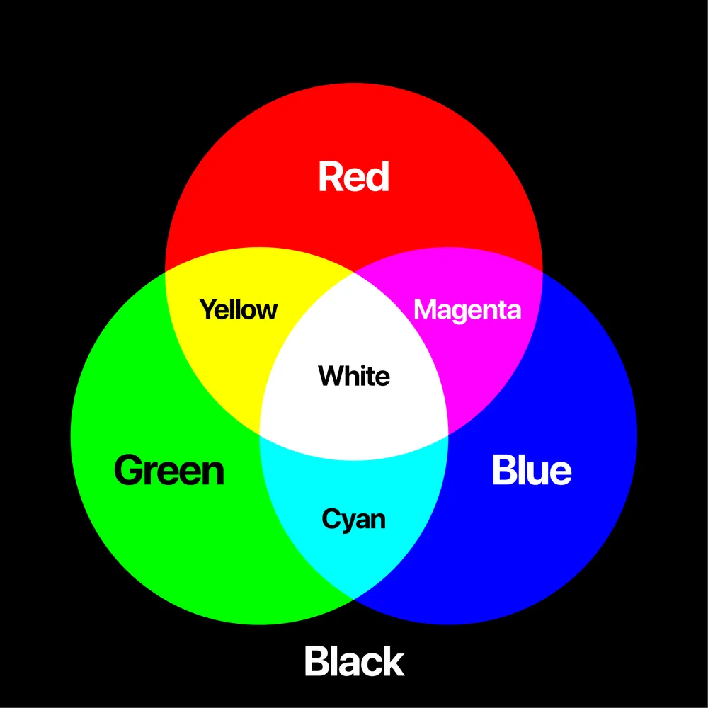

# HyperTest Markup Language

표현을 위한 언어

태그라는 형태로 
<태그> </태그>

마크업은 틀리더라도 그냥 무시하고 표현할 수 있음


HTML5: 계층구조

html<br> 
ㄴ head --- title <br>
ㄴ body --- h1


  self closing tag
  - br(line break)
  


  a 태그 : a href
  hyperlink refence


  tag와  attribute 차이
  - alt text(alternate text) : 웹접근성
  - label
  - aria-label


### minifying이 안 되어 있음
- 쿠팡 매우 느릴 것이다.

- minifying:코드에서 불필요한 공백, 주석, 개행, 긴 변수명 등을 제거하여 파일 크기를 줄이고 성능을 최적화하는 과정.
- 주로 HTML, CSS, JavaScript 파일을 압축할 때 사용<br>


👉 왜 minify(축소화)할까?
- 파일 크기 감소 → 웹 페이지 로딩 속도 향상
- 네트워크 트래픽 절감 → 사용자와 서버 간 데이터 전송량 줄이기
- 보안 향상 → 코드 가독성을 낮춰서 원본 코드 분석을 어렵게 만듦(코드 보호)
<br>
## Minify 전후 예제
1️⃣ JavaScript Minify 예제<br>
🔹 Minify 전 (원본 코드)
````javaScript
function sayHello(name) {
    console.log("Hello, " + name + "!");
}
sayHello("Alice");
````


🔹 Minify 후 (축소된 코드)
````JavaScript
function sayHello(a){console.log("Hello, "+a+"!")}sayHello("Alice");
````
✔ 공백 제거, 줄바꿈 제거, 변수명을 짧게 변경
<br><br><br>
2️⃣ CSS Minify 예제<br>
🔹 Minify 전 (원본 코드)
```css
body {
    background-color: white;
    font-size: 16px;
    color: black;
}
```

🔹 Minify 후 (축소된 코드)
```css
body{background-color:#fff;font-size:16px;color:#000;}
````
✔ 공백 제거, 색상 코드 최적화 (#ffffff → #fff)

<br><br>
3️⃣ HTML Minify 예제<br>
🔹 Minify 전 (원본 코드)
````html
<!DOCTYPE html>
<html>
    <head>
        <title>My Page</title>
    </head>
    <body>
        <h1>Welcome!</h1>
        <p>Hello, world!</p>
    </body>
</html>
````
🔹 Minify 후 (축소된 코드)

````html
<!DOCTYPE html><html><head><title>My Page</title></head><body><h1>Welcome!</h1><p>Hello, world!</p></body></html>
````
✔ 불필요한 개행 및 공백 제거 <br><br>

🔹 Minify 도구 추천: 직접 압축하지 않고도 자동으로 minify 해주는 도구들 존재

✅ 온라인 도구

- Terser → JavaScript 압축
- CSSNano → CSS 압축
- HTMLMinifier → HTML 압축


----
### short cut

ctrl + d  
alt + shift + 마우스 

### CSS Selector
- tag
- id : # 
- class : .

### color
- #RRGGBB : RGB 칼라 red/green/blue
- 개발자 계산기 / HEX(16진수)
- #00 ~ #FF
- 빛이 없다면 검정색 , 빛이 많다면 하얀색
- 0 (어둡) ~ 255 (밝음) 까지의 값으로 색상 표현
- True Color 라고 부름 
- 32bit color =2^24 = 1677만 color

2'4'8'16'32'64'128'512
1024'2048'4096'8192
16384'32768'65536


- 빛의 3원색


red
#FF0000 = #F00


https://encycolorpedia.kr/ff0000
