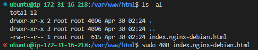
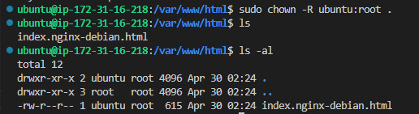

[이것이 Ubuntu다 - Ubuntu강좌]('https://youtu.be/pSuHUNghIeM?si=QL7yyHx-xCTZyVT3')

- 사용자 계정과 권한 /  21 ~ 25(4장 5,6,7,8) 필독
- 패키지 관리 필독 / 4장 10, 11, 12 

nginx 깔기

/etc : 설정파일 존재
/var/log

우분투의 nginx기본값
cd /var/www/html

1. root 외에 다른 사용자에게 쓰기 권한주기
2. 폴더 소유자 권한을 ubuntu로 변경한다

소유권 변경
sudo chown -R ubuntu:root .

recursive - R

OOM : 리눅스 커널

df -h
여기 확인 - availbility
use