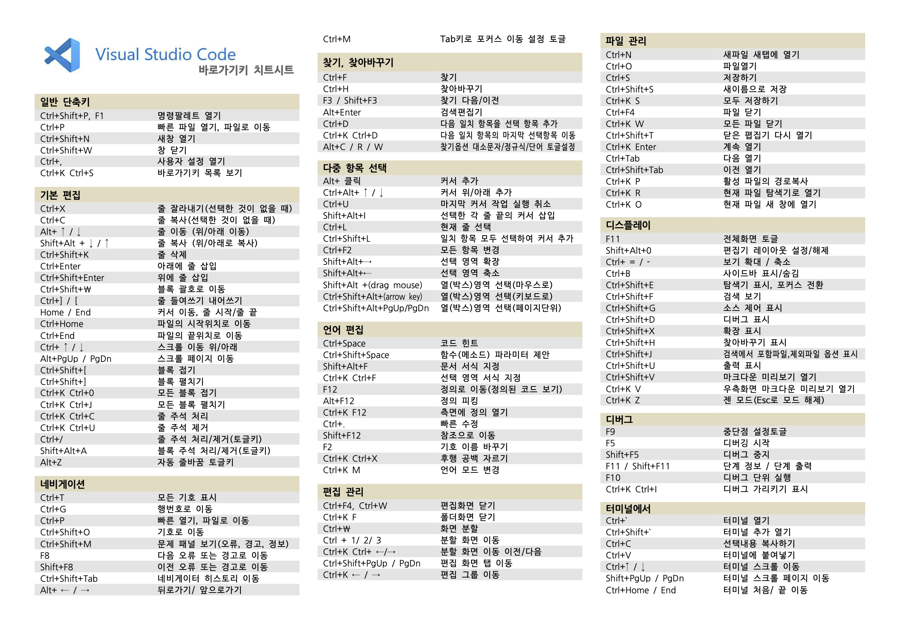
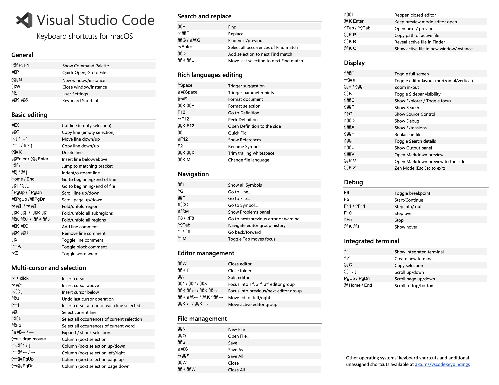

## VSCode Shortcut
### Window

### Mac

## RFC에 대해서

- 구글 - 크롬
- 모질라 - 파이어폭스 (넷스케이프 네비게이터)
- 마소 - 엣지(인터넷 익스플로러)

표준정의 표준화 단체 IEEE 802.11 WIFI , 802.15 Bluetooth 표준

- 통신 : 5G 통신 규약 <> 삼성, 엘지, 구글, 노키아 ...
- RFC(Request for Comment) : 표준 정의
  - RFC 1866 : HTML 2.0 표준
  - RFC 1945 : HTML 1.0 표준 (obsoleted by)

- SMTP simple mail Transfer Protocol

- HTTP RFC https://datatracker.ietf.org/doc/html/rfc2616

  - Client Error 4xx
    - 400 Bad Request
    - 401 Unauthorized
    - 402 Payment Required
    - 403 Forbidden
    - 404 Not Found
    - 405 Method NOt Allowed
    - 406 Not Acceptable

## 미니 면접 질문

  서버란 무엇인가?
  - 클라이언트(요청자)의 요청에 따라 응답하는 것(응답자)
  

해상도 px: 1920 x 1080 FHD